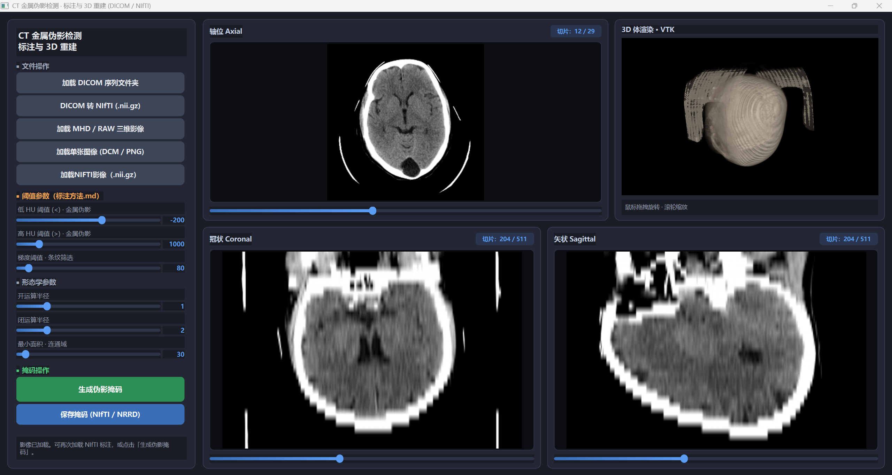

# CT 金属伪影检测标注与 3D 重建

基于 **SimpleITK**、**PySide6** 与 **VTK** 的脑部 CT 金属伪影半自动标注工具。支持 DICOM / NIfTI / MHD 等多种格式加载，按 HU 阈值与形态学规则生成伪影掩码，并在轴位、冠状、矢状三平面及 3D 体渲染中同步预览标注效果。



## 功能概览

- **多格式影像加载**：DICOM 序列文件夹、NIfTI（`.nii.gz`）、MHD/RAW、单张 DCM/PNG
- **DICOM 转 NIfTI**：将序列导出为 `.nii.gz`，便于后续处理与分享
- **伪影掩码生成**：基于《标注方法.md》中的 HU 规则，结合梯度筛选与形态学后处理
- **患者 ROI 自动提取**：生成掩码前自动排除空气、扫描床与 FOV 外背景
- **2D + 3D 联动显示**：三平面 MPR 叠加掩码，VTK 体渲染分色展示多连通域金属伪影
- **掩码导出**：支持保存为 NIfTI（`.nii.gz`）或 NRRD 格式

## 项目结构

```
SimplelTK/
├── CT_label_GUI.py          # 主程序入口（PySide6 图形界面）
├── dicom_io.py              # DICOM 序列读取
├── image_view.py            # 窗宽窗位、切片显示与图像缩放
├── metal_mask_pipeline.py   # 金属伪影掩码生成流水线
├── vtk_volume_viewer.py     # VTK 3D 体绘制与表面重建
├── 标注方法.md               # HU 阈值与视觉标注规则
├── SimpleITK滤波金属伪影掩码滤波器介绍.md  # 滤波步骤说明
├── presentation.png         # 界面截图
├── requirements.txt
└── README.md
```

## 环境要求

- Python 3.9+
- Windows / Linux / macOS（已在 Windows 下验证中文路径读写兼容）

## 安装

```bash
git clone https://github.com/Ericfare/CT_Metal_Label_System.git
cd CT_Metal_Label_System

python -m venv .venv
# Windows
.venv\Scripts\activate
# Linux / macOS
source .venv/bin/activate

pip install -r requirements.txt
```

## 运行

```bash
python CT_label_GUI.py
```

## 使用流程

1. **加载影像**：点击「加载 DICOM 序列文件夹」或「加载 NIFTI 影像（.nii.gz）」等按钮导入 CT 体数据。
2. **（可选）加载已有标注**：导入 NIfTI 掩码，在 2D 视图以红色叠加、3D 视图分色显示。
3. **调整参数**：左侧面板可调节低/高 HU 阈值、梯度阈值及形态学参数（默认值见《标注方法.md》）。
4. **生成掩码**：点击「生成伪影掩码」，程序会先建立患者 ROI，再执行阈值与形态学流水线。
5. **保存结果**：点击「保存掩码 (NIfTI / NRRD)」导出标注文件。

### 标注窗设置

程序采用脑部 CT 标注窗：**窗位 40 / 窗宽 80**（详见 `标注方法.md`），兼顾脑组织对比度与金属高/低 HU 条纹的可视化。

### 默认伪影 HU 规则

| 参数 | 默认值 | 说明 |
|------|--------|------|
| 低 HU 阈值 | -200 | HU 低于此值视为金属伪影候选 |
| 高 HU 阈值 | 1000 | HU 高于此值视为金属伪影候选 |
| 梯度阈值 | 80 | 结合条纹形态筛选 |
| 最小连通域 | 30 | 剔除过小噪点 |

更完整的判定标准与实操准则请参阅 [标注方法.md](标注方法.md)；各滤波步骤原理见 [SimpleITK滤波金属伪影掩码滤波器介绍.md](SimpleITK滤波金属伪影掩码滤波器介绍.md)。

## 注意事项

- **中文路径**：Windows 下含中文等非 ASCII 路径的 NIfTI/NRRD 读写已通过临时文件机制兼容，避免 ITK 弹窗报错。
- **医学数据**：请勿将含患者隐私的 DICOM 数据提交到公开仓库；本地 `CT Plain/` 目录已在 `.gitignore` 中排除。
- **依赖 VTK**：若 3D 视图无法显示，请确认已安装带 OpenGL 支持的 `vtk` 包，并更新显卡驱动。

## 许可证

本项目用于教学与科研标注实践。使用医学影像时请遵守相关伦理与数据合规要求。
